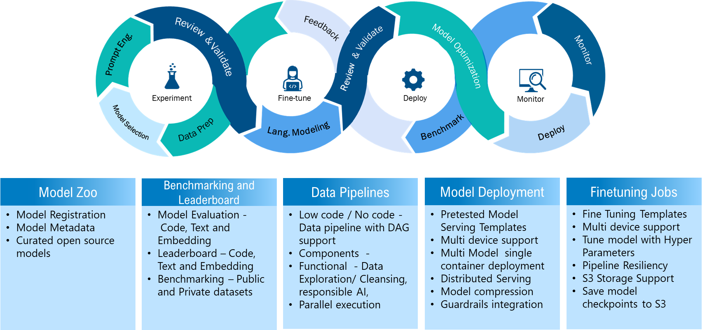

# Infosys Transformer Foundry

## Overview

Infosys Transformer Foundry solution provides buildings blocks for managing LLM Ops and model life cycle management such as model selection, finetuning, benchmarking, deployment at scale along with data pipelines.



## Features v1.0

- Model Zoo: Curated list of open source models along with their metadata, lifecycle status and model tagging.
- Leaderboard: LLM leaderboard for customer data (text, embedding and code) on public/private models for efficient selection of models.
- Benchmark tool: Allows benchmarking of fine-tuned or open source models.

## Roadmap

- Data Pipelines: Allow users to create custom data processing workflows for their models. 
- Fine Tuning: User can fine tune a model against custom datasets for tailored results.
- Model Deployment: Facilitate deployment of curated or fine-tuned models and create access points.

## Hardware & Software Requirements

Find the hardware and software requirements [here](docs/requirements.md)

## Installation

### Docker

<b>a. Clone the GitHub repository</b>

```
git clone -b < branch and Repo url>
```

<b>b. Build docker container for each component</b>

Navigate to each component folder within the repository and build the corresponding Docker image using the following command:

```dos
cd <component_folder>
docker build -t ${DOCKER_REPO}/<image_name>
```

<b>c. Run the Docker Container</b>

```dos
docker-compose -f docker-compose.yaml up
```

## Usage and Examples

[Benchmark Evaluation](docs/benchmark_evaluation.md)

## Reporting problems, asking questions

We appreciate your feedbacks, questions or bug reporting regarding this project. When posting issues in GitHub, ensure the posted examples follow the guidelines below:

<b>Minimal</b>: Provide the smallest possible code snippet that still reproduces the problem.

<b>Complete</b>: Include all necessary information (code, configuration, etc.) for someone else to replicate the issue.

<b>Reproducible</b>: Test your provided code to confirm it consistently reproduces the problem.
