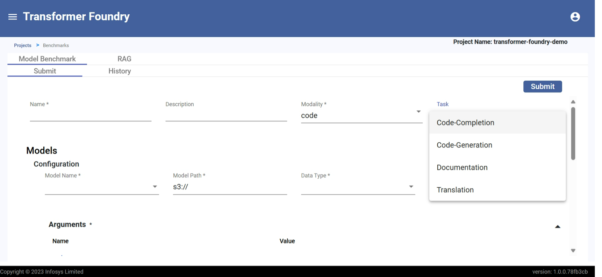

# Benchmark Tool

## Overview

Transformer Foundry offers comprehensive benchmarking across four critical modalities - code, text, embedding, and RAG. The platform leverages industry-standard evaluation harnesses for code, text, and embedding assessments, while utilizing RAGAS and LLM-as-a-judge models for RAG-specific evaluation. Users can bring their own datasets for custom benchmarking, ensuring evaluation relevance to specific business contexts.

## Features

- Comprehensive benchmarking across code, text, embedding, and RAG modalities
- Industry-standard evaluation harnesses for code, text, and embedding assessments
- RAGAS and LLM-as-a-judge models for RAG-specific evaluation
- Custom dataset support for business-specific benchmarking contexts
- Shared benchmark results across organizations for collaborative insights
- Standardized performance metrics for reliable model comparison
- Informed model selection decisions based on comprehensive evaluation data

#### Model Benchmarking
