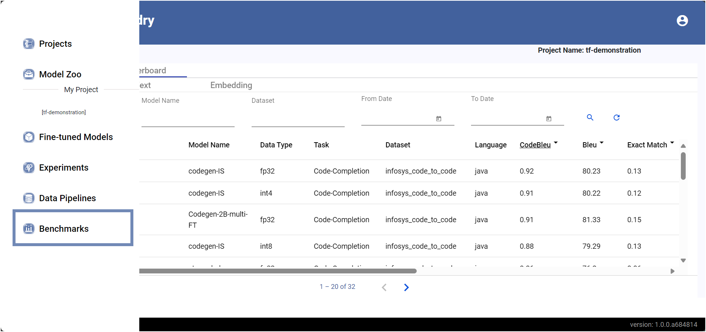
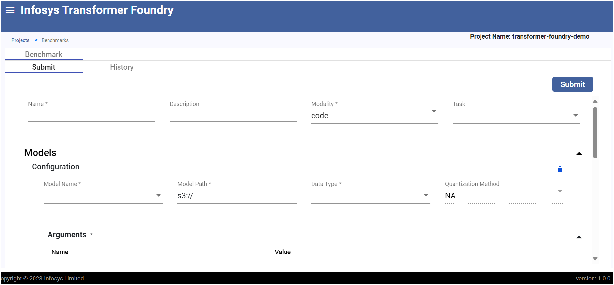
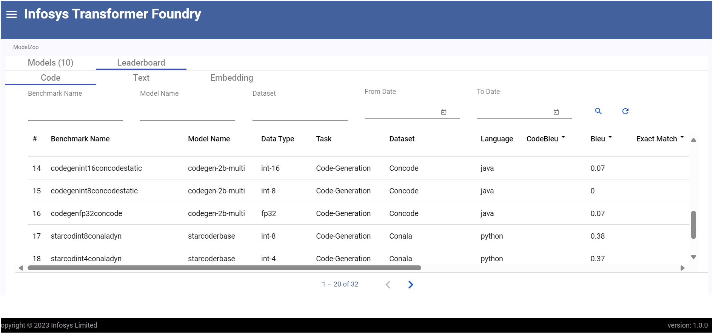

### Benchmark Evaluation

For code evalutaion, please create a docker container;Please refer the following links for code evaluation.

| Harness              | Repository link                                               |
| -------------------- | ------------------------------------------------------------- |
| code evaluation      | https://github.com/bigcode-project/bigcode-evaluation-harness |
| text evaluation      | https://github.com/EleutherAI/lm-evaluation-harness           |
| embedding evaluation | https://github.com/embeddings-benchmark/mteb                  |

### Creating and Viewing benchmarks
- Click on the Benchmarks option in side menu
  

  Fill the details and submit the benchmark
  

- View the results in the Leaderboard
  
