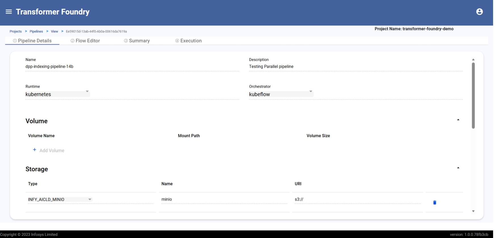
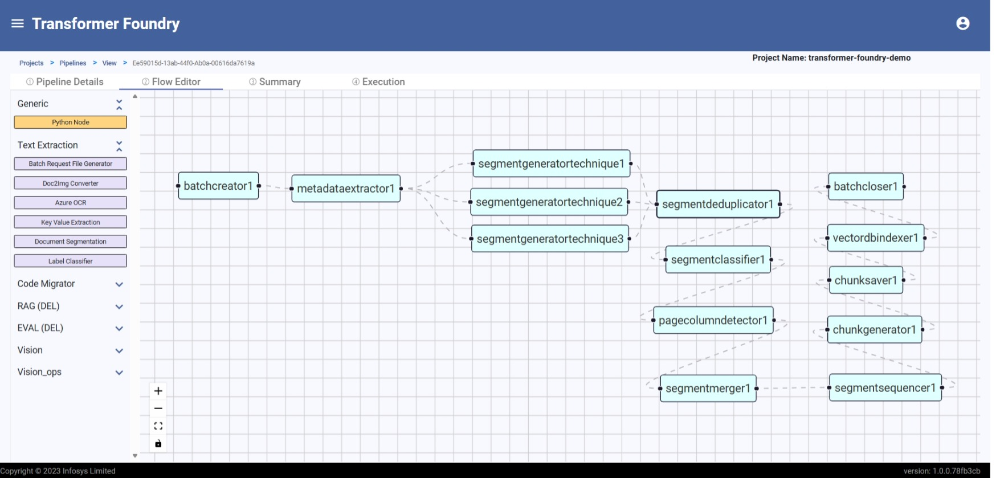

# Data Pipelines

## Overview

Infosys Transformer Foundry delivers powerful cloud-native DAG-based data pipelines designed to process large-scale structured and unstructured data efficiently. These pipelines are built as framework-agnostic templates, compatible with industry-standard orchestration engines such as Kubeflow, Apache Airflow, and others that support Directed Acyclic Graph workflows.

## Features

- Visual drag-and-drop pipeline design for rapid creation of complex workflows using curated, reusable components
- Horizontal scalability and parallel execution ensuring high-throughput data processing across distributed environments
- YAML-based configuration for building custom components and importing pre-tested pipeline templates
- Reusable pipeline templates with runtime parameterization for repeated execution with minimal overhead
- Framework-agnostic compatibility with Kubeflow, Apache Airflow, and other DAG-supporting orchestration engines

#### Data Pipeline Creation

#### Data Pipeline DAG Creation

