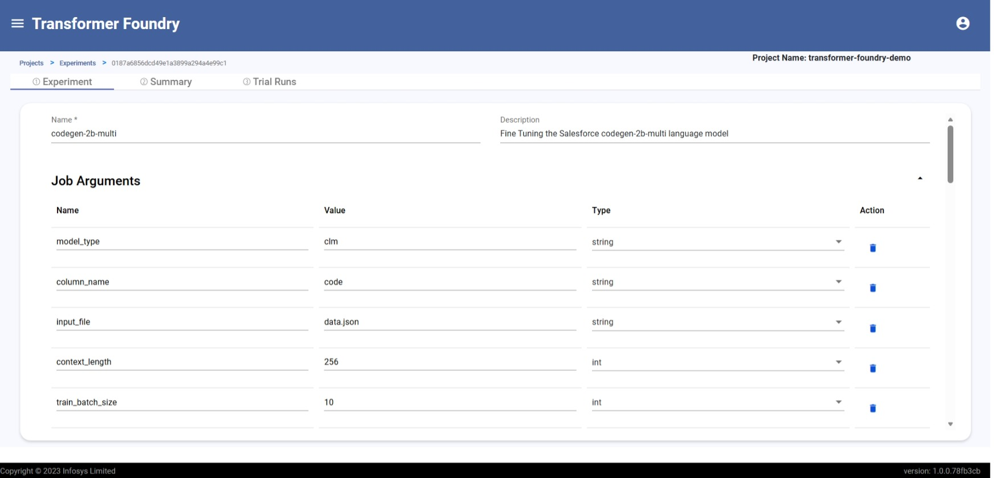

# Fine Tuning

## Overview

Infosys Transformer Foundry offers advanced fine-tuning capabilities through its cloud-native pipeline architecture, enabling enterprises to customize models at scale. With Bring Your Own Container (BYOC) support, users can leverage leading model engineering frameworks such as PyTorch, Hugging Face, Unsloth, and more—alongside their own scripts and datasets—to train models on their CPU/GPU infrastructure.

## Features

- Out-of-the-box templates for LLM fine-tuning configurable via YAML definitions
- Model checkpointing capabilities for saving training progress
- Automated hyperparameter tuning with configurable parameters
- Seamless integration with MLflow for comprehensive experiment tracking

#### Model Fine Tuning
