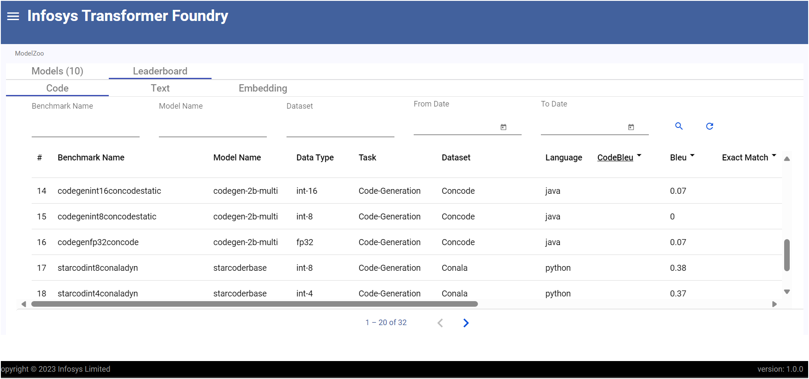

# Leaderboard

## Overview

The Leaderboard feature offers a unified view of LLM performance across text, embedding, and code tasks. It helps users easily compare models, both public and private by presenting their scores across multiple benchmark datasets, enabling more informed model selection.

## Features

- Multi-domain evaluation support for text, embedding, code and rag tasks
- Detailed performance analysis with various evaluation criteria
- Advanced filtering options to find the best model for specific use cases
- Support for various evaluation metrics including accuracy, F1-Score, BLEU Score, perplexity, latency, and memory usage
- Supports records level metrics for rag benchmarks.

#### Leaderboard - Code

#### Leaderboard - RAG

#### Leaderboard - RAG - record level metrics

