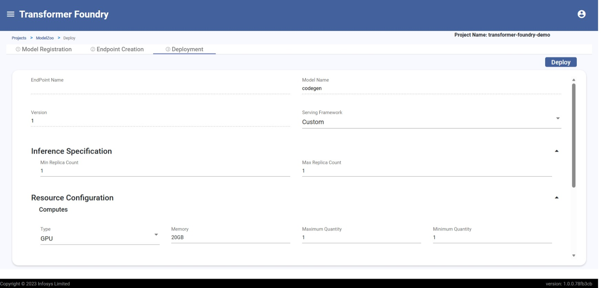

# Model Deployment

## Overview

Model Deployment facilitates the deployment of curated or fine-tuned models and creates access points for production use. This feature provides a comprehensive solution for taking models from development to production, ensuring scalable, reliable, and secure model serving.

## Features

- Deploy foundational or fine-tuned models and create production endpoints
- Support for Triton, DJL, or custom serving frameworks
- Scalable infrastructure with auto-scaling capabilities
- Version management for multiple model deployments
- Resource configuration for CPU, GPU, and memory
- Allows creation of multiple endpoints which can be selected during deployment

#### Model Deployment

