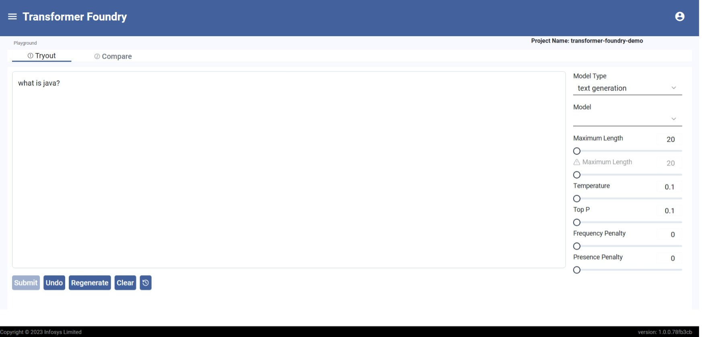

# LLM Playground

## Overview

LLM playground enables users to seamlessly compare pre-trained and fine-tuned models for various Generative AI tasks using the same prompt, while adjusting model-specific parameters as needed. This helps identify the best-performing models for specific tasks, saving time and resources.

This playground can also be used to experiment with different AI models from closed source providers and Infosys Applied AI Cloud.

## Features

- It allows you to test models in real time
- You can compare upto 3 models side by side
- You can adjust model parameters and settings
- You can view detailed performance metrics such the token count, the response time etc.
- You can access save your templates to the prompt library and access prompt templates shared by other users.

## Supported Models

- Text models (open source and Azure)
- Code models (open source and Azure)

#### LLM Playground Chat Completion

#### LLM Playground Model Compare
