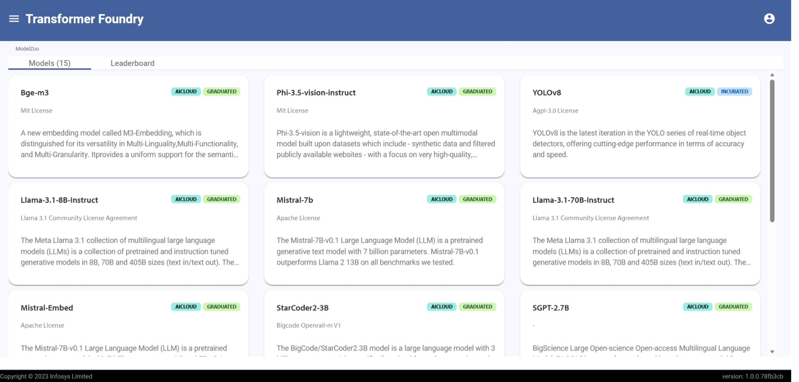
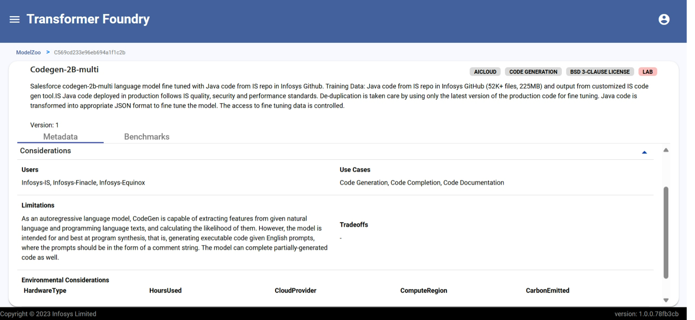

## Overview

Model Zoo which provides list of curated closed and open source models. Each card provides a brief discription along with the life cycle stage of a model.

## Features

- Shows a list of closed and open source models.
- Shows model life cycle status.
- Each card contains detailed metadata such as requirements, usecases, provenance information and drawbacks.
- They also show any model specific benchmarks.

#### Model Zoo

#### Model Card

