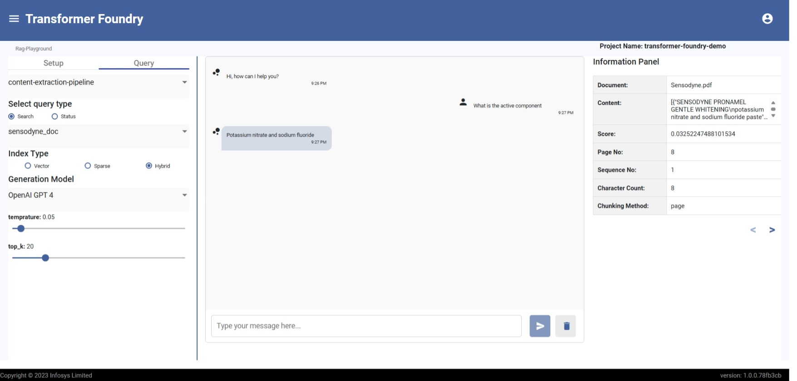

# RAG Playground

## Overview

Infosys Transformer Foundry delivers a powerful RAG-as-a-Service capability, seamlessly integrating Infosys Document Extraction Libraries with its cloud-native data pipelines for scalable ingestion, retrieval, and benchmarking. This enables enterprises to convert unstructured documents into intelligent, queryable knowledge bases with real-time ingestion and advanced indexing.

## Features

- Support for real time ingestion of multiple documents
- Customizable embedding models for advanced indexing and semantic search
- User can view the metadata for each response generated by the model (which document, which page and which paragraph).
- Vector search capabilities for semantic document retrieval and hybrid approach combining vector and sparse retrieval methods
- Chunking strategies for optimal document segmentation
- Tuning parameters for accuracy and relevance optimization

#### Rag Playground Chat Screen
